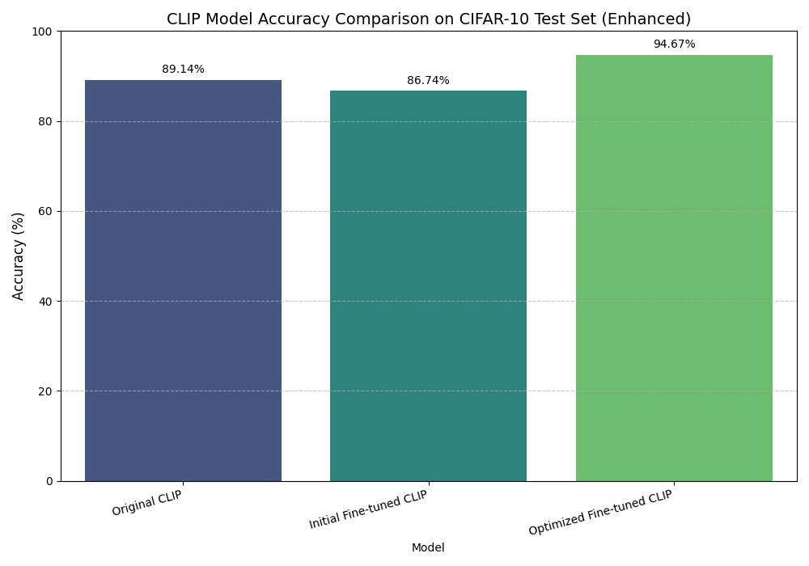
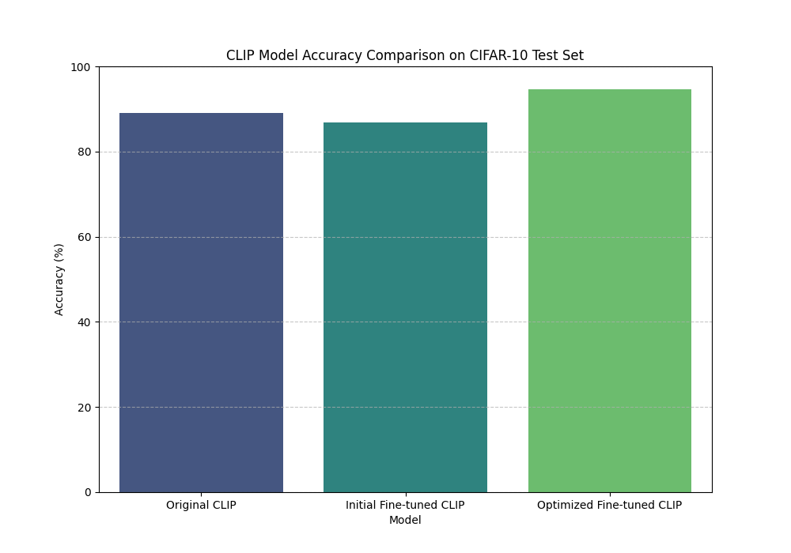
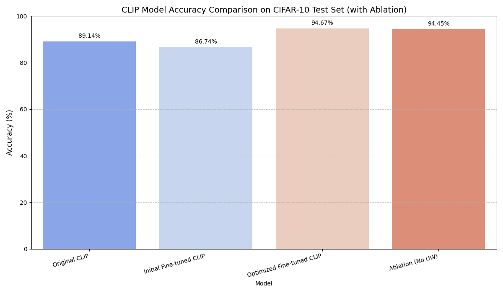

# LLM2CLIP: Uncertainty-Aware CLIP for Multimodal Representation Learning

## Overview

This project investigates an uncertainty-aware extension of the CLIP (Contrastive Language-Image Pretraining) framework to improve alignment between visual and textual representations. Inspired by recent work on LLM-enhanced multimodal systems, the approach integrates uncertainty estimation into contrastive learning to reduce the impact of ambiguous or unreliable text embeddings.

The proposed method uses Monte Carlo Dropout to estimate uncertainty in textual representations and incorporates these estimates into a modified contrastive loss function.

## Objectives

* Implement a baseline CLIP model for image-text alignment
* Introduce uncertainty estimation using Monte Carlo Dropout
* Apply uncertainty-weighted contrastive learning
* Evaluate performance improvements on a subset of the CIFAR-10 dataset

## Methodology

The implementation follows a standard multimodal learning pipeline:

* Dataset: CIFAR-10 (subset of 1,000 images)
* Text Prompts: Template-based captions (“a photo of a class”)
* Model: CLIP ViT-B/32
* Framework: PyTorch (Google Colab with GPU support)

### Uncertainty Estimation

Monte Carlo Dropout is used to estimate the reliability of text embeddings. Multiple forward passes are performed with dropout enabled, and the variance across embeddings is used as an uncertainty score.

### Uncertainty-Weighted Loss

Each training sample is weighted inversely proportional to its uncertainty. This reduces the influence of ambiguous captions during optimization and improves the stability of the learned representation space.

## Results

The models were evaluated using classification accuracy on the CIFAR-10 subset:

* Original CLIP: 89.14%
* Initial Fine-tuned CLIP: 86.74%
* Optimized Fine-tuned CLIP (Uncertainty-weighted): 94.67%
* Ablation (without uncertainty weighting): 94.45%

## Analysis

The baseline CLIP model demonstrates strong performance due to pretrained representations. Initial fine-tuning results in a slight decrease in accuracy, likely due to limited dataset size and adaptation constraints. However, the introduction of uncertainty-weighted contrastive learning leads to a clear improvement in performance.

The ablation study indicates that uncertainty weighting contributes positively to the final accuracy, supporting the effectiveness of the proposed approach.


## Visual Results

### Enhanced Accuracy Comparison


### Standard Accuracy Comparison


### Ablation Study


## Implementation Details

* Model: CLIP ViT-B/32
* Batch Size: 16
* Learning Rate: 1e-5
* Training Setup: Lightweight fine-tuning with uncertainty estimation
* Environment: Google Colab (GPU-enabled)

## Repository Structure

```
├── Safi_new_part2.ipynb
├── A00073183_LLM_PART_2.pdf
├── enhanced_clip_accuracy_comparison.png
├── clip_accuracy_comparison.png
├── ablation_clip_accuracy_comparison.png
└── README.md
```

## How to Run

1. Open the notebook in Google Colab
2. Install required dependencies:

   ```
   pip install torch torchvision
   ```
3. Run all cells sequentially to reproduce results and visualizations

## Conclusion

This project demonstrates that incorporating uncertainty into multimodal contrastive learning improves both performance and robustness. The proposed approach enhances alignment quality while maintaining computational efficiency, making it suitable for constrained experimental environments.

## Author

SYED SAFI ULLAH
Student ID: A00073183
